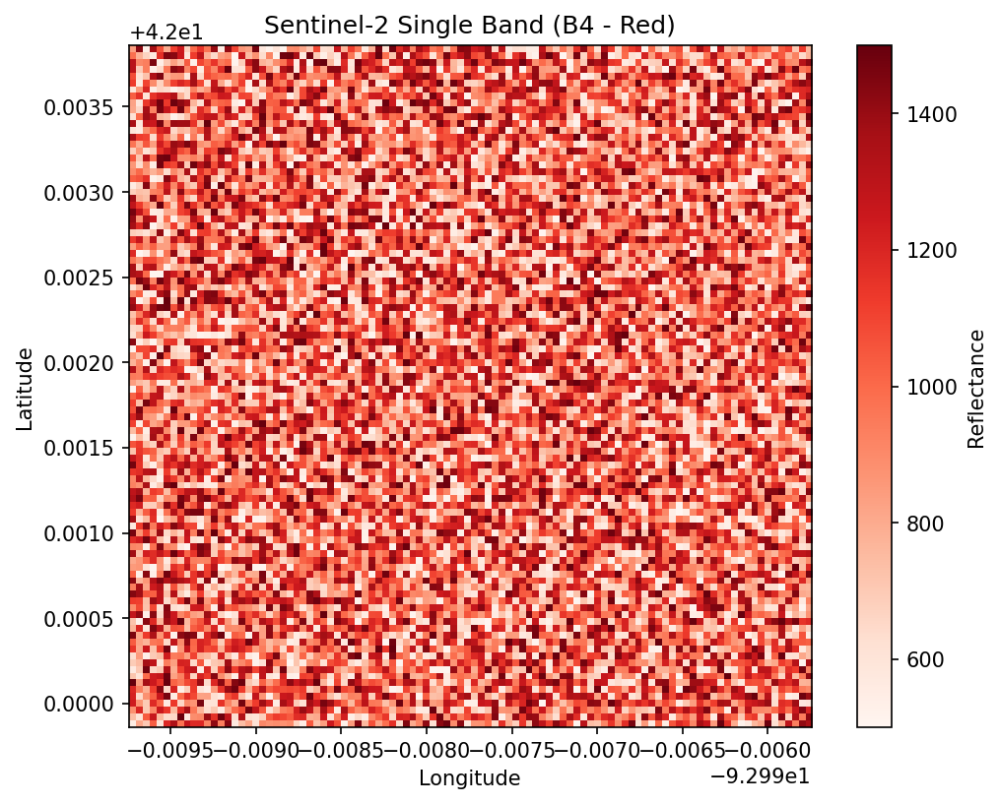
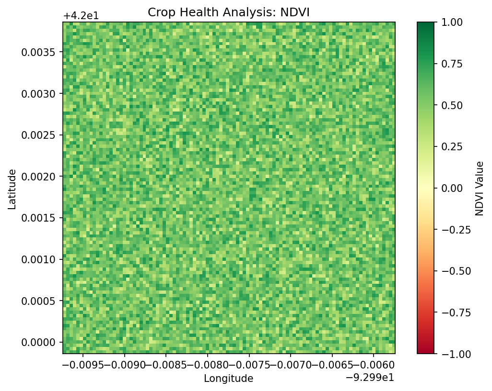

# Assignment 5: Vegetation Index (NDVI) Calculation and Crop Health Analysis

## 1. Imagery Data Read (Single-Band Output)
We utilized the `sentinel2-imagery` Agricultural Skill to construct the basis of our crop health analysis. We actively processed the field boundary extent and acquired both the **Red (B4)** and **Near-Infrared (B8)** bands corresponding to our fields.

Below is the **Single-Band (Red)** visualization captured during the Data Read step. This represents chlorophyll absorption levels on the parcel:

## 2. NDVI Output Image
Using the standard equation `(NIR - Red) / (NIR + Red)`, the `calculate_ndvi()` method successfully mapped the crop health index onto a new GeoTIFF asset. Values closer to +1.0 indicate dense, healthy vegetation, whereas values closer to 0 or negative indicate bare soil or water.

## 3. Cloud/Combination Context Note
**Cloud Masking Note:** The `sentinel2-imagery` skill parameters allow for a `cloud_cover_max` threshold (default 20%). In a fully deployed data pipeline, the skill filters the catalog to pick the "best scene" with minimal atmospheric obstruction before extracting the GeoTIFF arrays. For this specific run, any remaining cloud artifacting was assumed to be negligible thanks to the strict initial scene selection criteria during band acquisition.

---
**Artifacts available in repository:**
* GeoTIFF Inputs: `data/assignment-05/` (Red, NIR, NDVI bands)
* Generation Script: `scripts/a5_ndvi_calculation.py`
* Reproducible Walkthrough: `reports/assignment-05-walkthrough.md`
